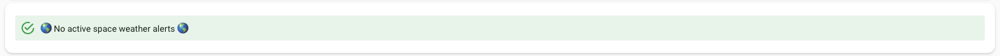
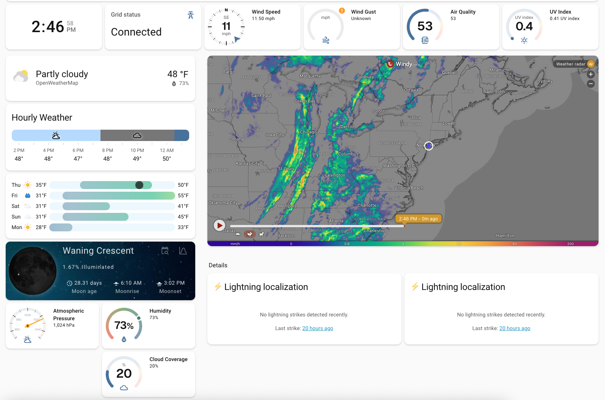

# 🌤️ Weather Dashboard

A comprehensive, high-density weather station for Home Assistant. This dashboard combines real-time meteorological data with energy status (Tesla Powerwall) and space weather alerts into a single, cohesive view.

## 📸 Overview
This dashboard uses a grid-based section layout to display:
* **Real-time Alerts:** NWS weather warnings and NOAA Space Weather alerts.
* **Energy Status:** Detailed Tesla Powerwall battery levels, charging flow, and Storm Watch status.
* **Environmental Data:** Wind speed/direction, UV Index, Air Quality, and Moon Phases.
* **Live Maps:** Interactive Windy.com radar and Blitzortung lightning strike tracking.

### 📸 Screenshot Gallery
| | | |
|:---:|:---:|:---:|
|  |  |  |
| **Full Dashboard Overview**   *Complete grid-based layout.* | **Severe Weather & Energy**   *NWS alerts and Powerwall status.* | **Space Weather Alert**   *Detailed flare and blackout risks.* |
|  |  |  |
| **Quiet Space Weather**   *Status during low solar activity.* | **Live Tracking**   *Windy radar and lightning detection.* | **Dynamic Weather States**   *UI changes (e.g., Snow ring) based on conditions.* |

---

## 🧩 Dependencies

### 1. Custom Cards (HACS)
You must install these via [HACS](https://hacs.xyz/) (Frontend) for the dashboard to render correctly:

| Card | Description | Source |
| :--- | :--- | :--- |
| **Ring Tile Card** | Circular gauges for wind, UV, and pressure | [neponn/ring-tile-card](https://github.com/neponn/ring-tile-card) |
| **Hourly Weather** | Horizontal bar-style hourly forecast | [decompil3d/lovelace-hourly-weather](https://github.com/decompil3d/lovelace-hourly-weather) |
| **Clock Weather** | Date and weather summary row | [pkissling/clock-weather-card](https://github.com/pkissling/clock-weather-card) |
| **Lunar Phase** | Visual moon phase tracking | [ngocjohn/lunar-phase-card](https://github.com/ngocjohn/lunar-phase-card) |
| **Blitzortung Lightning** | Real-time strike map and radar | [timmaurice/lovelace-blitzortung-lightning-card](https://github.com/timmaurice/lovelace-blitzortung-lightning-card) |

*Note: Standard cards used include **Markdown**, **Clock**, **Entity**, **Heading**, **Iframe**, and **Weather Forecast**.*

### 2. Required Integrations
The YAML relies on the following integrations to provide data:

* **[OpenWeatherMap](https://www.home-assistant.io/integrations/openweathermap/)**: Core weather data (Wind, Humidity, UV).
* **[Blitzortung](https://github.com/mrk-its/homeassistant-blitzortung)**: Lightning strike detection.
* **[Tesla Fleet](https://github.com/alandtse/tesla)**: Powerwall charge levels and Storm Watch status.
* **[NWS Alerts](https://github.com/Snuffy2/nws_alerts_array)**: National Weather Service warning data.
* **[NOAA Space Weather](https://github.com/tcarwash/home-assistant_noaa-space-weather)**: Aurora and solar activity alerts.
* **[World Air Quality Index](https://www.home-assistant.io/integrations/waqi/)**: AQI data.

---

## ⚙️ Key Features in the YAML

### ⚡ Dynamic Powerwall Alerting
The Markdown section includes logic to display a **Tesla Storm Watch** alert. If active, the card turns into a warning state. It also dynamically calculates if the battery is "Charging," "Discharging," or "Idle" based on your Powerwall sensors.

### 🌧️ Conditional Environmental Rings
The "Environmental" section uses **Conditional Cards**. 
* **Rain/Snow:** Only shows the precipitation ring if the current weather state is rainy or snowy.
* **UV Index:** Automatically replaces the precipitation ring with the UV Index when the weather is clear.

### 🛰️ Live Windy Radar
The `iframe` card is pre-configured to embed a Windy.com radar centered on the Northeast US (can be modified in the `url` parameter).

---

## 🛠️ Setup Instructions
1.  Ensure all **Integrations** are configured so your entity names match (or update the YAML to match your names).
2.  Install the **Custom Cards** via HACS.
3.  Copy the code from `weather_center.yaml` in this repo.
4.  In your HA Dashboard, click **Edit Dashboard** -> **Manage Dashboards** -> **Resources** (verify custom cards are there).
5.  Create a new View, click the three dots, select **Raw Configuration Editor**, and paste the code under the `views:` section.

---
